# CardioSense AI: Heart Disease Prediction System

CardioSense AI is a medical decision-support application that integrates supervised machine learning classifiers, an explainable AI framework (SHAP), and a high-performance web dashboard. The platform enables clinical practitioners to input physiological features, predict cardiovascular risk categories, view personalized clinical explanations, and generate printable reports.

---

## 📌 Problem Statement

Cardiovascular diseases (CVDs) represent the leading cause of mortality worldwide, accounting for an estimated 17.9 million deaths annually. Early identification of patient risk is vital to implementing preventive care. However, traditional screening methodologies are often manual, resource-intensive, and prone to subjective diagnostic errors. 

CardioSense AI addresses this challenge by providing a secure, automated, and highly interpretable screening system. By analyzing standard clinical patient metrics, the system calculates cardiac risk levels (Low, Medium, High) in milliseconds. To ensure clinical trust, it integrates game-theory-based explanations, revealing the individual risk factors driving each prediction.

---

## ⚡ Features

*   **Multi-Model Estimator Pipeline:** Evaluates multiple machine learning models (Random Forest, XGBoost, LightGBM, SVM, KNN, Logistic Regression) using 5-fold cross-validation.
*   **Explainable AI (XAI):** Built-in local feature attribution using SHAP (SHapley Additive exPlanations) to decompose how specific metrics influence the patient's score.
*   **Interactive Web Dashboard:** A responsive React frontend incorporating real-time risk gauges, history tracking, and patient data visualizations.
*   **Cardio Guide AI Chatbot:** A structured symptom-triage conversational assistant providing standard health guidelines and cardiologist recommendations.
*   **Secure API Guardrails:** FastAPI backend utilizing strict Pydantic schemas to validate and sanitize incoming clinical payloads.
*   **Clinical PDF Reporting:** Instantly compiles assessment metrics and visualization charts into an audit-ready, downloadable PDF using ReportLab.
*   **Persistent Query History:** SQLAlchemy ORM mapping predictions and model evaluations to a persistent SQLite database.

---

## 🛠️ Tech Stack

*   **Frontend:** React.js (Vite), TailwindCSS, Recharts (Data Visualization), Axios (HTTP Client)
*   **Backend:** FastAPI (Python), Uvicorn (ASGI Web Server)
*   **Database & ORM:** SQLite, SQLAlchemy ORM
*   **Machine Learning:** Scikit-Learn, SHAP, Imbalanced-Learn (SMOTE), Pandas, NumPy, Joblib
*   **Reporting:** ReportLab PDF Engine

---

## 🏗️ System Architecture & Workflow

CardioSense AI is structured as a decoupled client-server architecture. The user interface captures inputs and renders interactive diagrams, while the backend API handles authentication, serves inference, generates explanations, and handles database operations.

### Workflow Diagram
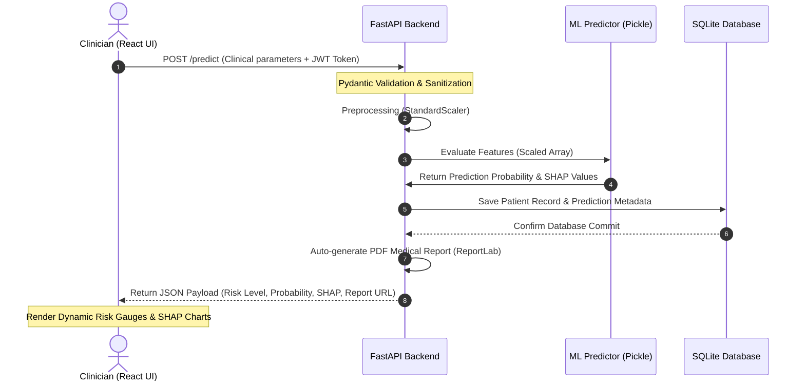

---

## 📊 Dataset Information

The models were developed using a standardized heart disease dataset consisting of **13 independent physiological features** and **1 binary target variable**:

| Feature Name | Short Name | Type | Description |
| :--- | :--- | :--- | :--- |
| **Age** | `age` | Numerical | Age of the patient in years |
| **Sex** | `sex` | Binary | Gender (1 = Male, 0 = Female) |
| **Chest Pain Type** | `cp` | Categorical | Pain type (0: Typical Angina, 1: Atypical Angina, 2: Non-anginal, 3: Asymptomatic) |
| **Resting Blood Pressure** | `trestbps` | Numerical | Resting blood pressure on admission to hospital (mm Hg) |
| **Serum Cholesterol** | `chol` | Numerical | Serum cholesterol in mg/dl |
| **Fasting Blood Sugar** | `fbs` | Binary | Fasting blood sugar > 120 mg/dl (1 = True, 0 = False) |
| **Resting ECG** | `restecg` | Categorical | ECG results (0: Normal, 1: ST-T wave abnormality, 2: Left ventricular hypertrophy) |
| **Max Heart Rate** | `thalach` | Numerical | Maximum heart rate achieved during stress test |
| **Exercise Angina** | `exang` | Binary | Exercise-induced angina (1 = Yes, 0 = No) |
| **Oldpeak** | `oldpeak` | Numerical | ST depression induced by exercise relative to rest |
| **ST Slope** | `slope` | Categorical | The slope of the peak exercise ST segment (0: Upsloping, 1: Flat, 2: Downsloping) |
| **Major Vessels** | `ca` | Numerical | Number of major vessels colored by fluoroscopy (0-4) |
| **Thalassemia** | `thal` | Categorical | Thalassemia type (1: Normal, 2: Fixed Defect, 3: Reversable Defect, etc.) |
| **Target** | `target` | Binary | Diagnosis of heart disease (0 = Absence/Healthy, 1 = Presence/At Risk) |

---

## ⚙️ Data Preprocessing Steps

To ensure high model generalization and prevent algorithmic bias, raw dataset columns underwent the following preprocessing pipeline:
1.  **Missing Value Handling:** Systematic imputation using feature medians for numerical columns and mode values for categorical columns to preserve distribution parameters.
2.  **Feature Scaling:** Applied `StandardScaler` to normalize continuous variables (`trestbps`, `chol`, `thalach`, `oldpeak`) to prevent features with larger magnitudes from dominating distance-based calculations.
3.  **Target Imbalance Correction:** Integrated **SMOTE (Synthetic Minority Over-sampling Technique)** to balance target categories. SMOTE synthesizes new examples in the feature space along the line segments joining k-nearest neighbors of the minority class.

---

## 🔍 Exploratory Data Analysis (EDA)

Exploratory analysis was conducted to uncover patterns, detect anomalies, and establish feature relationships:
*   **Correlation Analysis:** A Pearson correlation heatmap isolated key relationships. High positive correlations were identified between target risk and variables such as chest pain type (`cp`), maximum heart rate (`thalach`), and ST segment slope (`slope`).
*   **Distribution Inspection:** Histograms and boxplots were plotted to highlight outliers in resting blood pressure (`trestbps`) and cholesterol (`chol`).
*   **Bivariate Analysis:** Plotting features against the target revealed that patients experiencing exercise-induced angina (`exang` = 1) and those with a higher number of major vessels (`ca` > 0) correlated heavily with positive heart disease cases.

---

## 🏋️ Model Training

The predictive engine was built using a rigorous model-selection pipeline. Six distinct machine learning architectures were trained and compared:
1.  **Logistic Regression** (baseline linear classifier)
2.  **K-Nearest Neighbors (KNN)** (distance-based classifier)
3.  **Support Vector Machine (SVM)** (kernel-based classifier)
4.  **Gradient Boosting Classifier** (ensemble boosting)
5.  **XGBoost** (extreme gradient boosting)
6.  **Random Forest Classifier** (ensemble bagging)

**Hyperparameter Tuning:** Grid Search Cross-Validation (`GridSearchCV`) was performed on top-performing ensemble architectures to tune parameters (such as `n_estimators`, `max_depth`, and `min_samples_split`) across a 5-fold validation split.

---

## 📈 Model Evaluation Metrics

Performance evaluations were benchmarked using Test Accuracy, F1-Score, and the Area Under the Receiver Operating Characteristic Curve (AUC-ROC), which evaluates diagnostic sensitivity.

### Performance Benchmark Comparison

| Model | Test Accuracy | F1-Score | AUC-ROC | CV Mean AUC (5-Fold) |
| :--- | :---: | :---: | :---: | :---: |
| **Random Forest (Selected)** | **88.45%** | **0.883** | **0.9443** | **0.9239 ±0.010** |
| Gradient Boosting | 87.73% | 0.877 | 0.9394 | 0.9249 ±0.008 |
| XGBoost | 85.56% | 0.852 | 0.9251 | 0.9139 ±0.012 |
| LightGBM | 84.84% | 0.848 | 0.9291 | 0.9124 ±0.006 |
| SVM (RBF Kernel) | 84.48% | 0.828 | 0.9221 | 0.8910 ±0.007 |
| K-Nearest Neighbors (KNN) | 78.70% | 0.783 | 0.8732 | 0.8542 ±0.015 |
| Logistic Regression | 71.84% | 0.695 | 0.7428 | 0.7872 ±0.020 |

### Key Metrics of Selected Random Forest Model:
*   **Precision:** `87.5%` (minimizes false-positive clinical alarms)
*   **Recall (Sensitivity):** `89.0%` (crucial for clinical safety; minimizes false-negatives)
*   **AUC-ROC:** `0.9443` (excellent classification separator)

---

## 🎨 Frontend Overview

The web dashboard is built using **React (Vite)** to deliver a responsive, clinical-grade user interface:
*   **Interactive Charts:** Integrates `Recharts` to display real-time radial risk indicators and historical health trends.
*   **Authentication Flow:** Implements secure JWT storage in `localStorage` with Axios interceptors that attach auth headers to outgoing REST requests.
*   **Modular Architecture:** Designed with reusable UI cards, data-validation input forms, and dynamic diagnostic feedback containers.

---

## 🔌 Backend / API Overview

The backend service is powered by **FastAPI** to enable high-throughput, async prediction serving:
*   **Pydantic Schema Guard:** Validates user request payloads at runtime, returning `422 Unprocessable Entity` for invalid parameters.
*   **SQLAlchemy ORM:** Provides abstract interaction with the database, maintaining schemas for users, predictions, and query history.
*   **Auth Middleware:** Security module verifying Bearer JWT tokens to restrict historical clinical data to its owner.

### Main API Endpoints

| Endpoint | Method | Auth Required? | Description |
| :--- | :---: | :---: | :--- |
| `/api/auth/register` | `POST` | No | Creates a new user account |
| `/api/auth/login` | `POST` | No | Validates credentials and returns JWT token |
| `/api/predict` | `POST` | Yes | Validates input parameters, calculates risk, generates SHAP attributions, and commits to SQLite |
| `/api/history` | `GET` | Yes | Retrieves paginated historical assessments for the logged-in user |
| `/api/report/{id}` | `GET` | Yes | Generates and downloads a dynamic clinical report PDF |
| `/api/chatbot` | `POST` | No | Receives triage symptom questions and returns rule-based recommendations |

---

## 🔄 Prediction Flow

The sequence below describes the path a patient's metrics take through the system:
1.  **Form Input:** A practitioner inputs patient metrics on the React client.
2.  **API Dispatch:** An asynchronous HTTP `POST` request is dispatched to `/api/predict` containing the validated payload.
3.  **Data Preprocessing:** The backend loads the trained `StandardScaler` pipeline to scale values like blood pressure and cholesterol.
4.  **Inference:** The optimized Random Forest classifier evaluates the processed array and outputs raw probabilities.
5.  **Risk Tiers Mapping:**
    *   `0.0 - 0.39` $\rightarrow$ **Low Risk** 🟢 (lifestyle management recommended)
    *   `0.40 - 0.69` $\rightarrow$ **Medium Risk** 🟡 (clinical evaluation advised)
    *   `0.70 - 1.00` $\rightarrow$ **High Risk** 🔴 (immediate clinical intervention flagged)
6.  **Explanation Generation:** The SHAP explainer runs on the model to calculate localized Shapley values.
7.  **Database Commit:** SQLAlchemy saves features, risk metrics, and prediction timestamps to SQLite.
8.  **Client Update:** The UI updates dynamically, rendering the SHAP feature-importance plot and enabling the PDF download option.

---

## 📁 Folder Structure

```text
Heart-Diseases/
├── heart/
│   ├── backend/
│   │   ├── main.py                # FastAPI Application Entrypoint
│   │   ├── requirements.txt       # Backend Dependencies
│   │   ├── database/
│   │   │   ├── database.py        # SQLite Connection & Engine Setup
│   │   │   └── models.py          # SQLAlchemy User & Prediction Models
│   │   └── utils/
│   │       ├── pdf_report.py      # PDF Report Generator (ReportLab)
│   │       └── predictor.py       # ML Pipeline, Model Loader, and SHAP logic
│   ├── frontend/
│   │   ├── src/                   # React Application Source Code
│   │   │   ├── components/        # Reusable UI Elements (Forms, Gauges, Chat)
│   │   │   ├── pages/             # Dashboard, Login, Prediction Interface
│   │   │   └── App.jsx            # Routing & Entrypoint Layout
│   │   ├── package.json           # Frontend Node Dependencies
│   │   └── tailwind.config.js     # CSS Styling Configurations
│   └── models/
│       ├── random_forest.pkl      # Trained, serialized prediction model
│       └── scaler.pkl             # Fitted StandardScaler object
└── README.md                      # Project Presentation (This file)
```

---

## ⚙️ Installation Steps

### 1. Prerequisites
Ensure you have **Python 3.10+** and **Node.js 18+** installed on your system.

### 2. Backend Installation
```bash
# Navigate to the backend directory
cd heart/backend

# Create a virtual environment
python -m venv venv

# Activate the virtual environment
# Windows:
venv\Scripts\activate
# macOS/Linux:
source venv/bin/activate

# Install required packages
pip install -r requirements.txt
```

### 3. Frontend Installation
```bash
# Navigate to the frontend directory
cd ../frontend

# Install dependencies
npm install
```

---

## 🚀 How to Run the Project

### 1. Run Backend Server
Ensure your virtual environment is active in the backend directory, then execute:
```bash
# Initialize SQLite database schema
python -c "from database.database import init_db; init_db()"

# Start the FastAPI backend
uvicorn main:app --reload
```
*The backend API will initialize locally at `http://127.0.0.1:8000`*

### 2. Run Frontend Client
In a separate terminal, navigate to the frontend directory and start the dev server:
```bash
npm run dev
```
*The React client will launch at `http://localhost:5173` or `http://localhost:3000`*

---

## 🔮 Future Improvements

*   **ECG Stream Processing:** Implement recurrent layers (LSTM) or 1D-CNNs to evaluate continuous time-series ECG wave signals.
*   **Wearable API Integration:** Support REST telemetry polling to pull resting heart rates and activity levels from wearable APIs (Apple Health, Fitbit).
*   **Docker Containerization:** Package the environment inside Docker containers and transition SQLite to a production-grade PostgreSQL service.
*   **HL7/FHIR EHR Integration:** Adopt standard healthcare exchange formats (FHIR) to allow communication with existing hospital Electronic Health Record systems.

---

## 📸 Screenshots

*Below are UI visualizations demonstrating system interfaces*

### 1. Login Interface
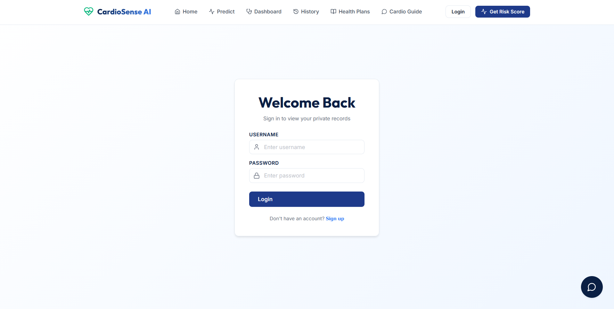

---

### 2. Home Page
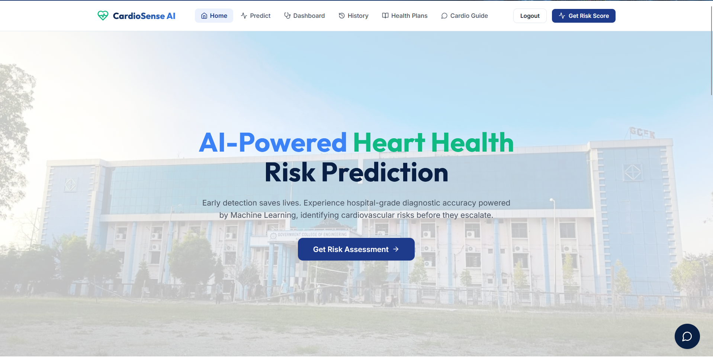

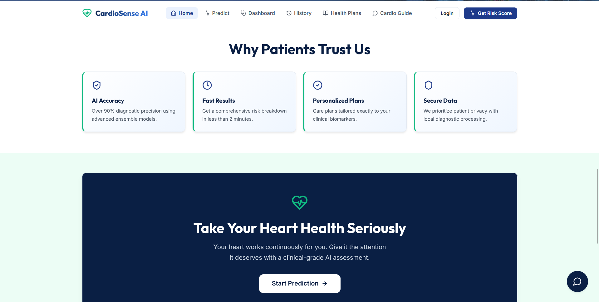

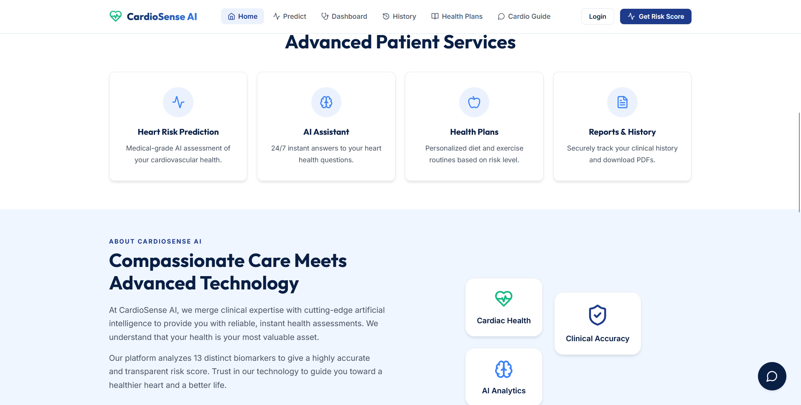

---

### 3. Prediction Form
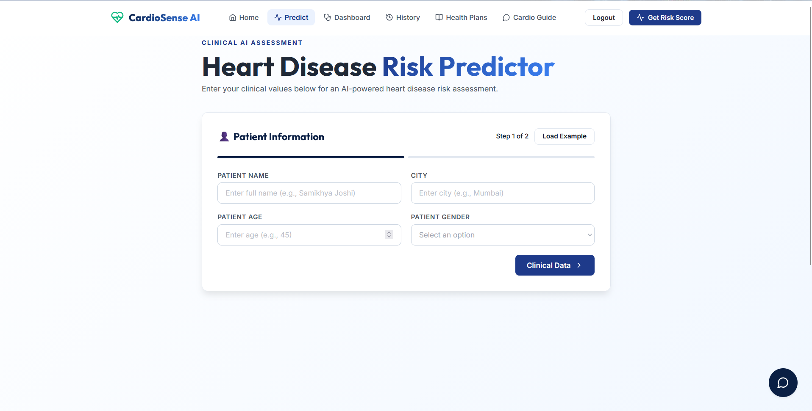

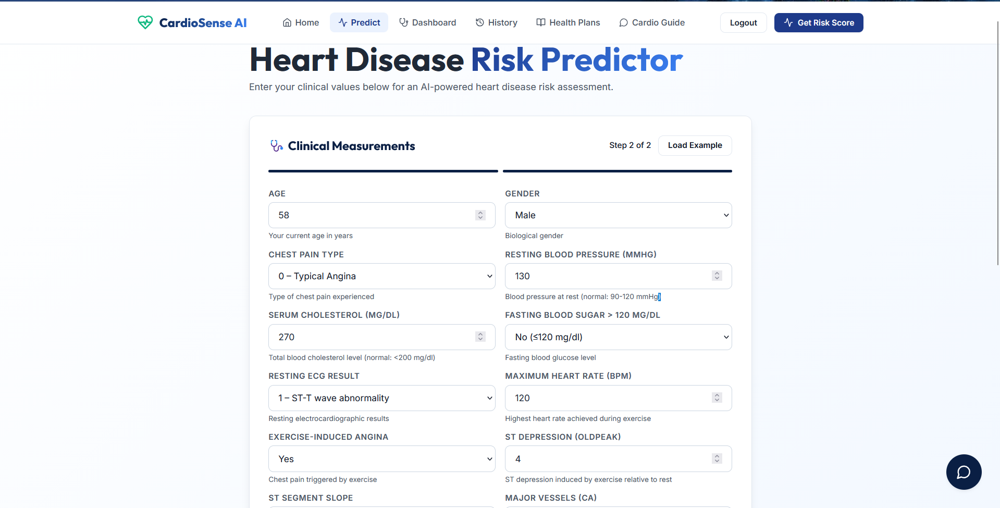

---

### 4. Risk Prediction Result
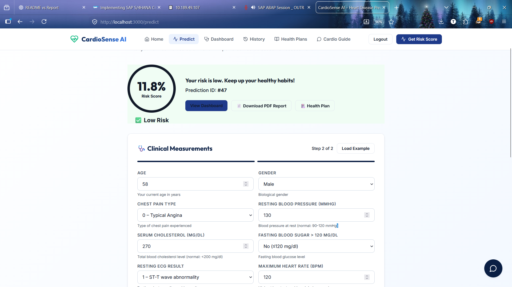

---

### 5. Clinical Analytics Dashboard
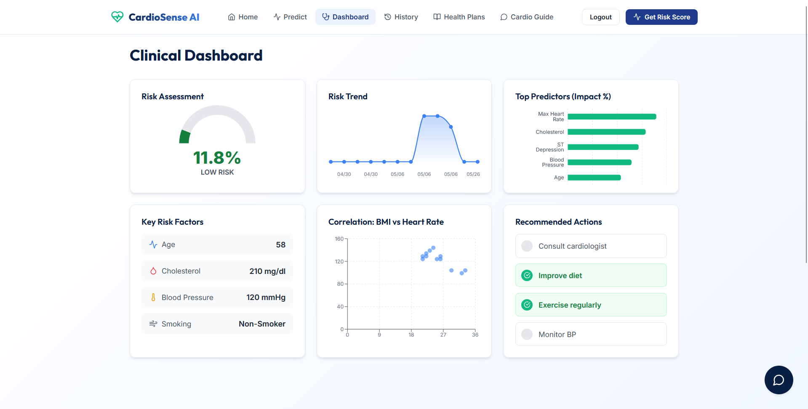

---

### 6. User Prediction History
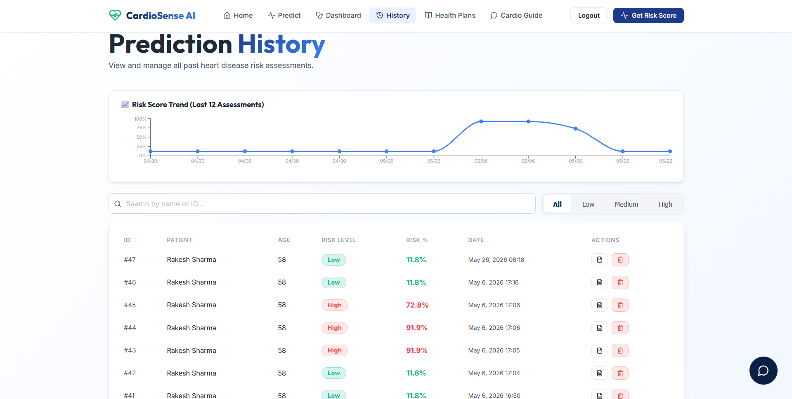

---

### 7. Health Recommendation System
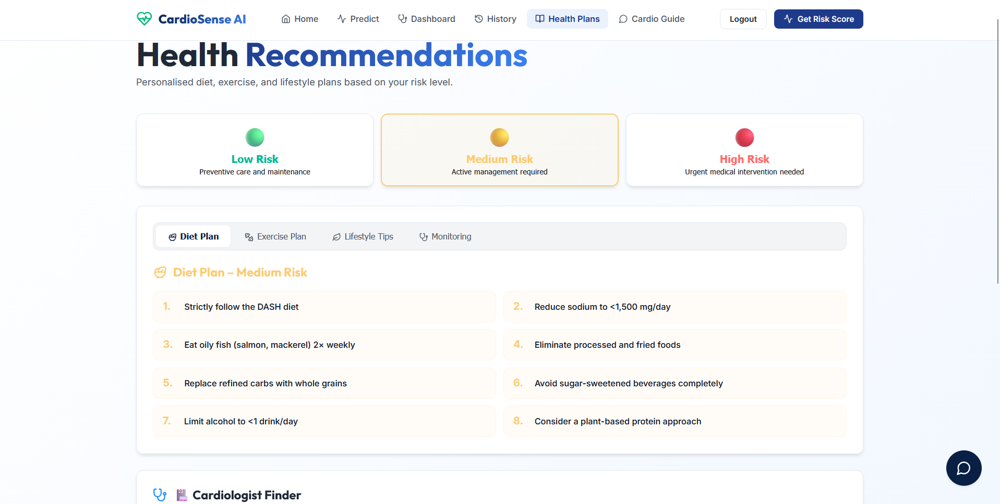

---

### 8. Downloadable PDF Report
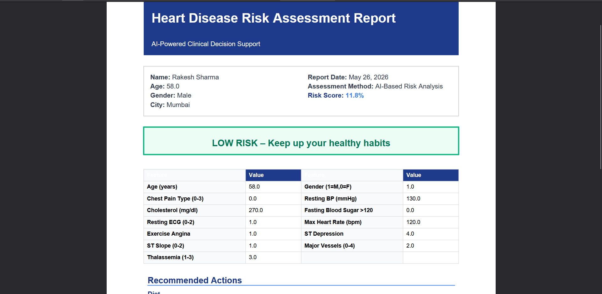

---

### 9. AI Chatbot Assistant
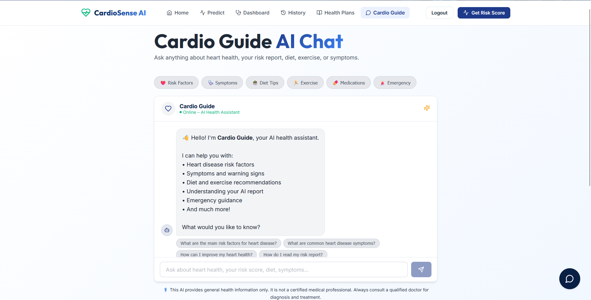

---

## 👥 Contributors & Academic Context

This project was developed collaboratively as a B.Tech Final Year Major Group Project.

### Core Team & Roles

| Team Member | Role |
| :--- | :--- |
| **Tanmaya Das** | Data Analytics + Partial Model Training |
| **Samikshya Joshi** | Core Model Development + Model Selection |
| **Pritam Kumar Swain** | Model Evaluation + Backend API |
| **Arpita Meghamala Chaini** | Frontend + Integration + Prediction Flow |

### Team Contributions
*   **Tanmaya Das** conducted comprehensive exploratory data analysis, handled outliers, created feature correlations, and built early prototyping model iterations.
*   **Samikshya Joshi** implemented the pre-processing pipelines, integrated target balancing using SMOTE, managed model tuning, and supervised the final Random Forest model selection.
*   **Pritam Kumar Swain** developed the FastAPI service, defined input validations using Pydantic, integrated SQLite/SQLAlchemy schemas, and computed evaluation benchmarks.
*   **Arpita Meghamala Chaini** designed the React dashboard interface, integrated state handling, connected API requests via Axios, and managed the prediction visual flow and chatbot components.

---

## 📄 License

This project is licensed under the MIT License.  
You are free to use, modify, and distribute this software in accordance with the license terms.

See the [LICENSE](LICENSE) file for more details.

---
## 🏁 Conclusion

CardioSense AI showcases the practical application of supervised machine learning algorithms in a full-stack, clinical-grade setting. By addressing the clinical "black box" challenge through game-theory explanations (SHAP) and offering an intuitive React/FastAPI layout, the project offers a robust framework for automated, transparent, and patient-centered diagnostic support systems.
